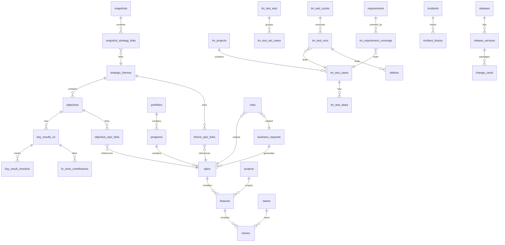

# Work Items Technical Reference

Complete technical documentation of all work items in the Guardrail system for Claude AI understanding.

---

## Table of Contents

1. [Work Item Hierarchy](#work-item-hierarchy)
2. [Entity Relationship Diagram](#entity-relationship-diagram)
3. [Strategic Layer](#strategic-layer)
4. [Execution Layer](#execution-layer)
5. [Quality Assurance Layer](#quality-assurance-layer)
6. [Operations Layer](#operations-layer)
7. [Cross-Cutting Concerns](#cross-cutting-concerns)
8. [Snapshot & Strategy Room](#snapshot--strategy-room)
9. [Type Definitions](#type-definitions)

---

## Work Item Hierarchy

```
┌─────────────────────────────────────────────────────────────────────────────┐
│                           STRATEGIC LAYER                                   │
│  ┌─────────────┐    ┌─────────────┐    ┌─────────────────────┐             │
│  │  Snapshot   │───▶│  Strategic  │───▶│    Objectives       │             │
│  │  (Point in  │    │   Themes    │    │   (OKR V2)         │             │
│  │   Time)     │    │             │    └──────────┬──────────┘             │
│  └─────────────┘    └─────────────┘               │                        │
│                                                    ▼                        │
│                                          ┌─────────────────────┐            │
│                                          │    Key Results V2   │            │
│                                          └─────────────────────┘            │
└─────────────────────────────────────────────────────────────────────────────┘
                                           │
                                           ▼
┌─────────────────────────────────────────────────────────────────────────────┐
│                           PORTFOLIO LAYER                                   │
│  ┌─────────────────────┐    ┌─────────────────────────────────────────┐    │
│  │  Business Requests  │───▶│              Epics                      │    │
│  │  (Demand Intake)    │    │  (Large strategic initiatives)         │    │
│  └─────────────────────┘    └──────────────────┬──────────────────────┘    │
│                                                │                            │
└────────────────────────────────────────────────┼────────────────────────────┘
                                                 │
                                                 ▼
┌─────────────────────────────────────────────────────────────────────────────┐
│                           PROGRAM LAYER                                     │
│                       ┌─────────────────────┐                               │
│                       │      Features       │                               │
│                       │  (Deliverable units)│                               │
│                       └──────────┬──────────┘                               │
│                                  │                                          │
│                                  ▼                                          │
│                       ┌─────────────────────┐                               │
│                       │      Stories        │                               │
│                       │  (User stories/     │                               │
│                       │   work items)       │                               │
│                       └─────────────────────┘                               │
└─────────────────────────────────────────────────────────────────────────────┘
                                   │
                    ┌──────────────┼──────────────┐
                    ▼              ▼              ▼
┌─────────────────────────────────────────────────────────────────────────────┐
│                    QUALITY ASSURANCE LAYER                                  │
│  ┌──────────────┐  ┌──────────────┐  ┌──────────────┐  ┌──────────────┐    │
│  │  Test Cases  │  │  Test Sets   │  │ Test Cycles  │  │   Defects    │    │
│  │  (tm_test_   │  │  (Groups)    │  │ (Execution   │  │  (Bugs)      │    │
│  │   cases)     │  │              │  │  periods)    │  │              │    │
│  └──────────────┘  └──────────────┘  └──────────────┘  └──────────────┘    │
└─────────────────────────────────────────────────────────────────────────────┘
                                   │
                                   ▼
┌─────────────────────────────────────────────────────────────────────────────┐
│                       OPERATIONS LAYER                                      │
│  ┌──────────────┐  ┌──────────────┐  ┌──────────────┐                      │
│  │  Releases    │  │  Incidents   │  │    Risks     │                      │
│  │  (Versions)  │  │  (Issues)    │  │              │                      │
│  └──────────────┘  └──────────────┘  └──────────────┘                      │
└─────────────────────────────────────────────────────────────────────────────┘
```

---

## Entity Relationship Diagram



---

## Strategic Layer

### 1. Snapshots

**Table:** `snapshots`

Point-in-time captures of the strategic landscape for analysis and comparison.

| Column | Type | Description |
|--------|------|-------------|
| id | uuid | Primary key |
| name | text | Snapshot name |
| description | text | Description |
| snapshot_date | date | Date of snapshot |
| created_by | uuid | User who created |
| created_at | timestamptz | Creation timestamp |
| is_baseline | boolean | Is this a baseline snapshot |
| status | text | Status (draft, active, archived) |

**Key Relationships:**
- Links to `strategic_themes` via `snapshot_strategy_links`
- Used in Strategy Room for time-based analysis

---

### 2. Strategic Themes

**Table:** `strategic_themes`

High-level strategic pillars that guide organizational direction.

| Column | Type | Description |
|--------|------|-------------|
| id | uuid | Primary key |
| snapshot_id | uuid | FK to snapshots |
| name | text | Theme name |
| description | text | Theme description |
| status | text | Status (active, proposed, etc.) |
| owner_id | uuid | Theme owner |
| sort_order | integer | Display order |
| color | text | Theme color for UI |
| start_date | date | Start date |
| end_date | date | End date |
| health | text | Health indicator |
| created_at | timestamptz | Creation timestamp |
| updated_at | timestamptz | Last update |

**Key Relationships:**
- Parent of `objectives`
- Links to `epics` via `theme_epic_links`
- Scoped by `snapshots` via `snapshot_strategy_links`

---

### 3. Objectives (OKR V2)

**Table:** `objectives`

Strategic objectives following OKR methodology.

| Column | Type | Description |
|--------|------|-------------|
| id | uuid | Primary key |
| theme_id | uuid | FK to strategic_themes |
| name | text | Objective name |
| description | text | Description |
| owner_id | uuid | Objective owner |
| status | text | Status |
| health | text | Health (on-track, at-risk, off-track) |
| overall_progress | numeric | Calculated progress 0-100 |
| start_date | date | Start date |
| end_date | date | End date |
| is_v2 | boolean | V2 OKR format flag |
| created_at | timestamptz | Creation timestamp |
| updated_at | timestamptz | Last update |

**Key Relationships:**
- Child of `strategic_themes`
- Parent of `key_results_v2`
- Links to `epics` via `objective_epic_links`

---

### 4. Key Results V2

**Table:** `key_results_v2`

Measurable outcomes for objectives.

| Column | Type | Description |
|--------|------|-------------|
| id | uuid | Primary key |
| objective_id | uuid | FK to objectives |
| summary | text | Key result summary |
| description | text | Detailed description |
| owner_id | uuid | KR owner |
| baseline_value | numeric | Starting value |
| current_value | numeric | Current value |
| goal_value | numeric | Target value |
| metric_type | text | Type (number, percentage, currency, boolean) |
| metric_unit | text | Unit of measurement |
| confidence | numeric | Confidence level 0-100 |
| status | text | Status |
| sort_order | integer | Display order |
| created_at | timestamptz | Creation timestamp |
| updated_at | timestamptz | Last update |

**Key Relationships:**
- Child of `objectives`
- Has `key_result_checkins` for progress tracking
- Links to work via `kr_work_contributions`

---

## Execution Layer

### 5. Business Requests

**Table:** `business_requests`

Demand intake and portfolio management.

| Column | Type | Description |
|--------|------|-------------|
| id | uuid | Primary key |
| request_key | text | Unique key (BR-XXX) |
| title | text | Request title |
| description | text | Description |
| requestor | text | Requestor name |
| business_owner | text | Business owner |
| business_owner_id | uuid | FK to business_owners |
| department_id | uuid | FK to departments |
| product_id | uuid | FK to products |
| process_step | text | Current process step |
| health | text | Health status |
| priority_tier | text | Priority tier |
| rank | integer | Priority rank |
| business_score | integer | Business value score |
| complexity | text | Complexity assessment |
| urgency | text | Urgency level |
| start_date | date | Planned start |
| end_date | date | Planned end |
| estimated_cost_sar | numeric | Estimated cost |
| approval_decision | text | Approval status |
| approval_date | date | Date approved |
| created_at | timestamptz | Creation timestamp |
| updated_at | timestamptz | Last update |
| deleted_at | timestamptz | Soft delete |

**Key Relationships:**
- Can generate `epics`
- Has `risks` linked via `business_request_id`
- Has `business_request_links` for attachments
- Has `business_request_discussions` for comments

---

### 6. Epics

**Table:** `epics`

Large strategic initiatives spanning multiple PIs.

| Column | Type | Description |
|--------|------|-------------|
| id | uuid | Primary key |
| epic_key | text | Unique key (E-XXX) |
| name | text | Epic name |
| description | text | Description |
| theme_id | uuid | FK to strategic_themes |
| program_id | uuid | FK to programs |
| owner_id | uuid | Epic owner |
| assignee_id | uuid | Assigned to |
| status | epic_status | Status enum |
| state | epic_state | State (not_started, in_progress, done) |
| health | health_status | Health indicator |
| estimate | numeric | T-shirt or points estimate |
| points_estimate | numeric | Story points estimate |
| start_date | date | Start date |
| end_date | date | End date |
| mvp | boolean | Is MVP |
| capitalized | boolean | Is capitalized |
| strategic_value_score | integer | Strategic value |
| effort_swag | integer | Effort estimate |
| process_step_id | uuid | Current process step |
| linked_business_request_id | uuid | Source business request |
| created_at | timestamptz | Creation timestamp |
| updated_at | timestamptz | Last update |
| deleted_at | timestamptz | Soft delete |
| parked_at | timestamptz | Parked timestamp |

**Enums:**
- `epic_status`: proposed, analysis, funnel, implementing, realizing, done, cancelled
- `epic_state`: not_started, in_progress, done
- `health_status`: green, yellow, red

**Key Relationships:**
- Links to themes via `theme_epic_links`
- Links to objectives via `objective_epic_links`
- Parent of `features`
- Has `risks` linked

---

### 7. Features

**Table:** `features`

Deliverable units of functionality.

| Column | Type | Description |
|--------|------|-------------|
| id | uuid | Primary key |
| feature_key | text | Unique key (F-XXX) |
| name | text | Feature name |
| description | text | Description |
| epic_id | uuid | FK to epics |
| project_id | uuid | FK to projects |
| team_id | uuid | Owning team |
| owner_id | uuid | Feature owner |
| assignee_id | uuid | Assigned to |
| status | text | Status |
| state | feature_state | State enum |
| health | health_status | Health indicator |
| story_points | numeric | Estimated points |
| start_date | date | Start date |
| end_date | date | Target end date |
| target_sprint_id | uuid | Target sprint |
| created_at | timestamptz | Creation timestamp |
| updated_at | timestamptz | Last update |

**Key Relationships:**
- Child of `epics`
- Parent of `stories`
- Scoped to `projects`
- Links to releases via `release_feature_links`

---

### 8. Stories

**Table:** `stories`

User stories and work items.

| Column | Type | Description |
|--------|------|-------------|
| id | uuid | Primary key |
| story_key | text | Unique key (S-XXX) |
| name | text | Story title |
| description | text | Description |
| feature_id | uuid | FK to features |
| team_id | uuid | Owning team |
| assignee_id | uuid | Assigned to |
| reporter_id | uuid | Reporter |
| status | text | Status |
| state | story_state | State enum |
| priority | text | Priority (critical, high, medium, low) |
| story_points | numeric | Story points |
| start_date | date | Start date |
| sprint_id | uuid | Current sprint |
| created_at | timestamptz | Creation timestamp |
| updated_at | timestamptz | Last update |

**Key Relationships:**
- Child of `features`
- Has `acceptance_criteria`
- Has `story_comments`
- Assigned to `teams`

---

## Quality Assurance Layer

### 9. Test Cases (TM Module)

**Table:** `tm_test_cases`

Test case definitions.

| Column | Type | Description |
|--------|------|-------------|
| id | uuid | Primary key |
| case_key | varchar | Unique key (TC-XXXX) |
| project_id | uuid | FK to tm_projects |
| folder_id | uuid | FK to tm_folders |
| title | varchar | Test case title |
| description | text | Description |
| preconditions | text | Preconditions |
| expected_result | text | Expected result |
| status | tm_case_status | Status (draft, approved, deprecated) |
| priority_id | uuid | Priority reference |
| case_type_id | uuid | Type reference |
| test_type | varchar | Type (functional, regression, etc.) |
| automation_status | varchar | Automation status |
| estimated_time | integer | Estimated minutes |
| assigned_to | uuid | Assigned user |
| release_version_id | uuid | Release version |
| is_ai_generated | boolean | AI generated flag |
| created_by | uuid | Creator |
| created_at | timestamptz | Creation timestamp |
| updated_at | timestamptz | Last update |

**Key Relationships:**
- Belongs to `tm_projects`
- Has `tm_test_steps`
- Grouped in `tm_test_sets` via `tm_test_set_cases`
- Executed in `tm_test_runs`
- Links to `requirements` via `tm_requirement_coverage`

---

### 10. Test Cycles

**Table:** `tm_test_cycles`

Test execution periods.

| Column | Type | Description |
|--------|------|-------------|
| id | uuid | Primary key |
| cycle_key | varchar | Unique key (CY-XXX) |
| project_id | uuid | FK to tm_projects |
| name | varchar | Cycle name |
| description | text | Description |
| status | tm_cycle_status | Status |
| planned_start_date | date | Planned start |
| planned_end_date | date | Planned end |
| actual_start_date | date | Actual start |
| actual_end_date | date | Actual end |
| release_version_id | uuid | Release version |
| environment | varchar | Test environment |
| created_by | uuid | Creator |
| created_at | timestamptz | Creation timestamp |
| updated_at | timestamptz | Last update |

**Key Relationships:**
- Contains `tm_test_runs`
- Links to `release_versions`
- Has execution statistics

---

### 11. Defects

**Table:** `defects` (stored as injira_issues with type='bug')

Bug tracking within test execution.

| Column | Type | Description |
|--------|------|-------------|
| id | uuid | Primary key |
| key | text | Defect key (DEF-XXX) |
| summary | varchar | Defect summary |
| description | text | Description |
| status | text | Status |
| severity | text | Severity (critical, major, minor, trivial) |
| priority | text | Priority |
| assignee_id | uuid | Assigned user |
| reporter_id | uuid | Reporter |
| project_id | uuid | Project |
| found_in_cycle_id | uuid | Test cycle where found |
| linked_test_run_id | uuid | Test run that found it |
| created_at | timestamptz | Creation timestamp |
| updated_at | timestamptz | Last update |
| resolved_at | timestamptz | Resolution timestamp |

**Key Relationships:**
- Links to `tm_test_runs` via `test_execution_defects`
- Links to `features` or `stories`

---

## Operations Layer

### 12. Releases

**Table:** `releases`

Release management.

| Column | Type | Description |
|--------|------|-------------|
| id | uuid | Primary key |
| name | text | Release name |
| description | text | Description |
| program_id | uuid | FK to programs |
| status | text | Status |
| release_date | date | Planned release date |
| actual_release_date | date | Actual release date |
| created_at | timestamptz | Creation timestamp |
| updated_at | timestamptz | Last update |

**Key Relationships:**
- Has `release_versions`
- Links to `features` via `release_feature_links`
- Contains `change_cards`

---

### 13. Release Versions

**Table:** `release_versions`

Version tracking within releases.

| Column | Type | Description |
|--------|------|-------------|
| id | uuid | Primary key |
| release_id | uuid | FK to releases |
| version_number | text | Version (e.g., "1.0.0") |
| description | text | Description |
| status | text | Status |
| release_date | date | Version release date |
| created_at | timestamptz | Creation timestamp |

**Key Relationships:**
- Child of `releases`
- Referenced by `tm_test_cases.release_version_id`
- Contains `change_cards`

---

### 14. Incidents

**Table:** `incidents`

Incident management.

| Column | Type | Description |
|--------|------|-------------|
| id | uuid | Primary key |
| incident_key | text | Unique key (INC-XXX) |
| title | text | Incident title |
| description | text | Description |
| project_id | uuid | Affected project |
| severity | severity_level | Severity (SEV1-SEV4) |
| impact | text | Impact level |
| urgency | text | Urgency level |
| priority | priority_level | Priority (P1-P4) |
| status | incident_status | Status |
| assignee_id | uuid | Assigned user |
| reporter_id | uuid | Reporter |
| resolved_at | timestamptz | Resolution time |
| root_cause | text | Root cause analysis |
| created_at | timestamptz | Creation timestamp |
| updated_at | timestamptz | Last update |

**Enums:**
- `severity_level`: critical, major, minor, low
- `incident_status`: new, acknowledged, investigating, resolved, closed
- `priority_level`: P1, P2, P3, P4

**Key Relationships:**
- Has `incident_history` for audit trail
- Has `incident_committees` for review
- Has `sla_records` for SLA tracking

---

### 15. Risks

**Table:** `risks`

Risk management.

| Column | Type | Description |
|--------|------|-------------|
| id | uuid | Primary key |
| risk_number | integer | Sequential number |
| title | text | Risk title |
| description | text | Description |
| status | text | Status (Open, Mitigated, Closed) |
| occurrence | text | Probability (High, Medium, Low) |
| impact | text | Impact level |
| relationship | text | Risk relationship type |
| resolution_method | text | Resolution approach |
| owner_id | uuid | Risk owner |
| program_id | uuid | FK to programs |
| related_item_id | uuid | Related work item |
| business_request_id | uuid | FK to business_requests |
| target_resolution_date | date | Target resolution |
| mitigation | text | Mitigation plan |
| contingency | text | Contingency plan |
| created_by | uuid | Creator |
| created_at | timestamptz | Creation timestamp |
| updated_at | timestamptz | Last update |

**Key Relationships:**
- Links to `epics`, `features`, or `stories` via `related_item_id`
- Links to `business_requests`
- Has `risk_links` for attachments

---

## Cross-Cutting Concerns

### Link Tables

| Table | Purpose |
|-------|---------|
| `snapshot_strategy_links` | Links snapshots to strategic themes |
| `theme_epic_links` | Links themes to epics |
| `objective_epic_links` | Links objectives to epics |
| `kr_work_contributions` | Links key results to work items |
| `release_feature_links` | Links releases to features |
| `tm_requirement_coverage` | Links requirements to test cases |
| `work_item_dependencies` | Cross-work-item dependencies |
| `test_execution_defects` | Links test runs to defects |

### Common Patterns

**Soft Delete:** Most tables use `deleted_at` timestamp for soft deletes.

**Audit:** Tables have `created_at`, `updated_at`, `created_by` columns.

**Health Status:** Uses `health_status` enum: `green`, `yellow`, `red`.

**States vs Status:**
- **State**: Workflow state (not_started, in_progress, done)
- **Status**: Detailed status within workflow

---

## Snapshot & Strategy Room

### Strategy Room Purpose

The Strategy Room is the executive dashboard for:
1. Viewing strategic alignment across themes, objectives, and execution
2. Comparing snapshots over time
3. Monitoring health and progress of strategic initiatives
4. Linking strategy to execution (themes → objectives → epics)

### Snapshot Flow

```
1. Create Snapshot (point-in-time capture)
      │
      ▼
2. Link Strategic Themes to Snapshot
      │
      ▼
3. View Objectives under Themes
      │
      ▼
4. Track Key Results progress
      │
      ▼
5. See Epic alignment via theme_epic_links & objective_epic_links
```

### Data Model for Strategy Room

```typescript
// Snapshot with linked themes
interface SnapshotWithThemes {
  id: string;
  name: string;
  snapshot_date: string;
  themes: StrategicTheme[];
}

// Theme with objectives and linked epics
interface StrategicTheme {
  id: string;
  name: string;
  description: string;
  status: string;
  health: HealthStatus;
  objectives: Objective[];
  linkedEpicCount: number;
}

// Objective with key results
interface Objective {
  id: string;
  name: string;
  description: string;
  health: HealthStatus;
  overall_progress: number;
  owner_id: string;
  keyResults: KeyResultV2[];
}

// Key Result with check-ins
interface KeyResultV2 {
  id: string;
  summary: string;
  metric_type: 'number' | 'percentage' | 'currency' | 'boolean';
  baseline_value: number;
  current_value: number;
  goal_value: number;
  progress: number; // calculated
}
```

---

## Type Definitions

### Work Item Status Enums

```typescript
// Epic Status
type EpicStatus = 
  | 'proposed'
  | 'analysis'
  | 'funnel'
  | 'implementing'
  | 'realizing'
  | 'done'
  | 'cancelled';

// Epic State
type EpicState = 'not_started' | 'in_progress' | 'done';

// Feature State
type FeatureState = 'not_started' | 'in_progress' | 'done';

// Story State
type StoryState = 'not_started' | 'in_progress' | 'done';

// Health Status
type HealthStatus = 'green' | 'yellow' | 'red';

// Test Case Status
type TmCaseStatus = 'draft' | 'approved' | 'deprecated';

// Test Cycle Status
type TmCycleStatus = 'planned' | 'in_progress' | 'completed' | 'cancelled';

// Test Run Status
type TmRunStatus = 
  | 'not_run'
  | 'passed'
  | 'failed'
  | 'blocked'
  | 'skipped';

// Incident Status
type IncidentStatus = 
  | 'new'
  | 'acknowledged'
  | 'investigating'
  | 'resolved'
  | 'closed';

// Severity Level
type SeverityLevel = 'critical' | 'major' | 'minor' | 'low';

// Priority Level
type PriorityLevel = 'P1' | 'P2' | 'P3' | 'P4';
```

### Key Type Formats

```typescript
// Work Item Keys
type EpicKey = `E-${number}`;        // E-001, E-002
type FeatureKey = `F-${number}`;     // F-001, F-002
type StoryKey = `S-${number}`;       // S-001, S-002
type TestCaseKey = `TC-${number}`;   // TC-0001
type CycleKey = `CY-${number}`;      // CY-001
type IncidentKey = `INC-${number}`;  // INC-123
type BusinessRequestKey = `BR-${number}`; // BR-001
```

---

## Database Relationships Summary

### Primary Hierarchies

1. **Strategic Hierarchy:**
   ```
   Snapshot → Strategic Theme → Objective → Key Result V2
   ```

2. **Execution Hierarchy:**
   ```
   Program → Epic → Feature → Story
   ```

3. **Quality Hierarchy:**
   ```
   Project → Test Case → Test Run → Defect
   ```

4. **Operations Hierarchy:**
   ```
   Release → Release Version → Change Card
   ```

### Cross-Hierarchy Links

| From | To | Link Table |
|------|------|------------|
| Strategic Theme | Epic | theme_epic_links |
| Objective | Epic | objective_epic_links |
| Key Result | Work Item | kr_work_contributions |
| Release | Feature | release_feature_links |
| Requirement | Test Case | tm_requirement_coverage |
| Test Run | Defect | test_execution_defects |
| Risk | Epic/Feature | risks.related_item_id |
| Business Request | Epic | epics.linked_business_request_id |

---

## Access Patterns

### Common Queries

1. **Get themes for a snapshot:**
   ```sql
   SELECT st.* FROM strategic_themes st
   JOIN snapshot_strategy_links ssl ON ssl.theme_ids @> ARRAY[st.id]
   WHERE ssl.snapshot_id = $1
   ```

2. **Get objectives with progress:**
   ```sql
   SELECT o.*, 
     AVG(kr.current_value / NULLIF(kr.goal_value, 0) * 100) as progress
   FROM objectives o
   LEFT JOIN key_results_v2 kr ON kr.objective_id = o.id
   WHERE o.theme_id = $1 AND o.is_v2 = true
   GROUP BY o.id
   ```

3. **Get epics linked to theme:**
   ```sql
   SELECT e.* FROM epics e
   JOIN theme_epic_links tel ON tel.epic_id = e.id
   WHERE tel.theme_id = $1 AND e.deleted_at IS NULL
   ```

4. **Get test coverage:**
   ```sql
   SELECT r.*, COUNT(tc.id) as test_count
   FROM requirements r
   LEFT JOIN tm_requirement_coverage rc ON rc.requirement_id = r.id
   LEFT JOIN tm_test_cases tc ON tc.id = rc.test_case_id
   GROUP BY r.id
   ```

---

*Document generated for Claude AI reference. Last updated: January 2025*
