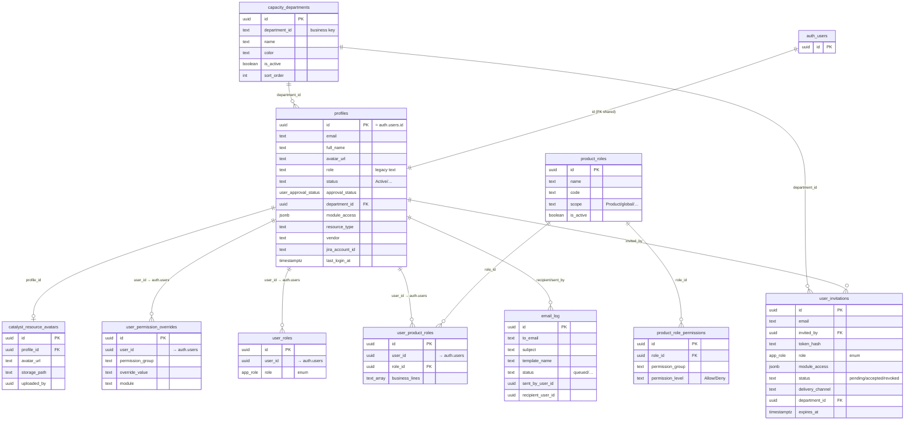

# Admin Access & RBAC — ERD, Purpose & Data

> Scope: the four admin surfaces
> `/admin/access`, `/admin/roles`, `/admin/permissions`, `/admin/capacity-departments`
> Source: live DB schema (`information_schema`) + page/hook code trace. Generated 2026-06-27.

---

## 1. Page → Component → Tables map

| Route | Page component | Primary hooks | Tables touched |
|---|---|---|---|
| `/admin/access` | `src/pages/admin/AdminAccessPage.tsx` | `useApprovedProfiles`, `useResourceAvatarOverrides`, `useInviteUser` | `profiles`, `user_roles`, `capacity_departments`, `user_invitations`, `email_log`, `catalyst_resource_avatars` |
| `/admin/roles` | `src/pages/admin/RolesAdminPage.tsx` | `useProductRoles`, `useUsersWithRole`, `useRolePermissions` | `product_roles`, `user_product_roles`, `product_role_permissions`, `profiles` |
| `/admin/permissions` | `src/pages/admin/PermissionsAdminPage.tsx` | `useProductRoles`, `useAllRolePermissions` | `product_roles`, `product_role_permissions` |
| `/admin/capacity-departments` | `src/pages/admin/CapacityDepartments.tsx` | `useCapacityDepartments` | `capacity_departments`, `profiles` (link-check) |

Identity (`user_id`, `invited_by`, `approved_by`, …) resolves to `auth.users`. App joins user data through `profiles` (PK = `auth.users.id`).

---

## 2. Mermaid ERD



> Note: only 4 formal FKs exist in DB — `product_role_permissions.role_id→product_roles`,
> `user_product_roles.role_id→product_roles`, `profiles.department_id→capacity_departments`,
> `catalyst_resource_avatars.profile_id→profiles`. All `user_id`-style columns point at
> `auth.users` (logical, not declared FK in `public`).

---

## 3. Per-page purpose & data

### 3.1 `/admin/access` — Users & Access
**Purpose:** single hub for the user lifecycle — invite users, approve/reject signups, view the
people directory, assign org role + department, manage avatars, and audit invitation/email delivery.

Key data:
- **`profiles`** (61 rows) — the people directory. Holds identity, `approval_status`
  (`PENDING_APPROVAL`/approved/rejected), `status`, `department_id`, `module_access` (jsonb feature
  gating), `resource_type`, `vendor`, login/lockout telemetry.
- **`user_roles`** (2 rows) — legacy org-level role enum (`app_role`). Superseded operationally by
  `user_product_roles` but still read on this page.
- **`user_invitations`** (9 rows; `pending`/`accepted`/`revoked`) — token-hashed invites with TTL,
  `delivery_channel` (email/sms), `module_access`, optional `department_id`. Written via the
  `user-invite-send` / `invitation-expire` edge functions.
- **`email_log`** (14 rows) — delivery audit for invite/notification emails (`status`, provider id,
  open/click/bounce timestamps).
- **`catalyst_resource_avatars`** (0 rows) — per-profile avatar overrides (storage path + url).
- **`capacity_departments`** — read for the department dropdown on invite/edit.

### 3.2 `/admin/roles` — Roles
**Purpose:** manage the catalogue of product roles, see who holds each role, and view the
permission matrix attached to a selected role.

Key data:
- **`product_roles`** (26 rows) — role catalogue: `name`, unique `code`, `scope`
  (`Product`/`product`/`global`), `is_active`. Examples: Super Admin (`super_admin`, global),
  Project Manager, QA Tester, React Developer, Business Analyst, PMO, Enterprise Architect.
- **`user_product_roles`** (2 rows) — assignment join (`user_id` ↔ `role_id`) with optional
  `business_lines[]` scoping.
- **`product_role_permissions`** (832 rows) — per-role permission rows shown when a role is selected.
- **`profiles`** — resolves assigned users' names/avatars.

### 3.3 `/admin/permissions` — Permissions
**Purpose:** the full role × permission grid. One row per permission group, one column per role,
cell = Allow/Deny. Read-mostly matrix view built from all roles + all their permission rows.

Key data:
- **`product_roles`** (26) — matrix columns.
- **`product_role_permissions`** (832) — matrix cells. Two axes:
  - `permission_group` (~33 distinct), e.g. *Product: Create Story*, *Product: Start Sprint*,
    *Product: View Backlog*, *Project: Create*, *Project: Delete*, *Project: Manage Members*,
    *Project: View All Projects*.
  - `permission_level` ∈ {`Allow`, `Deny`}.
- **`user_permission_overrides`** (0 rows) — per-user exceptions to role defaults
  (`override_value`, scoped by `module`). Empty today; layered on top of role grants at resolve time.

### 3.4 `/admin/capacity-departments` — Departments
**Purpose:** CRUD the department catalogue used by capacity planning and by user/invite assignment.
Delete is guarded by a link-check against `profiles`.

Key data:
- **`capacity_departments`** (5 rows): **Delivery, Governance, Operations, Product, Technical
  Support**. Fields: `name`, business-key `department_id` (text), `color` (default `#0d9488`),
  `is_active`, `sort_order`.
- **`profiles`** — read only to block deletion of a department that still has members
  (`profiles.department_id`).

---

## 4. Row-count snapshot (dev DB, 2026-06-27)

| Table | Rows |
|---|---|
| profiles | 61 |
| product_role_permissions | 832 |
| product_roles | 26 |
| user_invitations | 9 |
| capacity_departments | 5 |
| email_log | 14 |
| user_product_roles | 2 |
| user_roles | 2 |
| user_permission_overrides | 0 |
| catalyst_resource_avatars | 0 |

---

## 5. RBAC resolution model (how it fits together)

```
auth.users ─1:1─ profiles ──┐
                            ├─ department_id ─→ capacity_departments
                            └─ avatar override ─→ catalyst_resource_avatars

Effective permissions for a user =
    product_roles  (via user_product_roles)         -- base grants
      → product_role_permissions (Allow/Deny)        -- per group
    THEN user_permission_overrides (per user)        -- exceptions win

Legacy:  user_roles.role (app_role enum)  -- coarse org role, being phased out
Lifecycle: user_invitations → (accept) → profiles.approval_status → email_log audit
```
