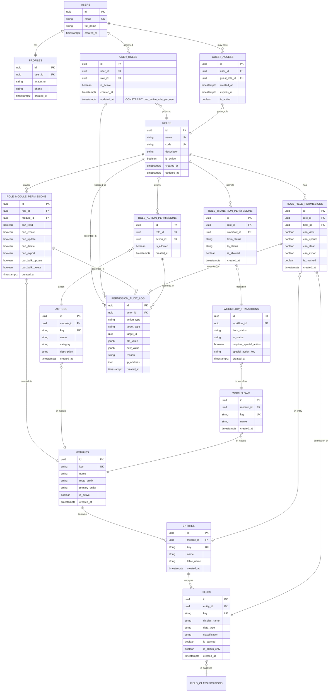

# 02. Architecture & Entity Relationship Diagram

**Status:** Approved  
**Last Updated:** 2026-06-24

---

## Current-State Issues

### What Was Broken Before Role Management

1. **Hardcoded role groups** — `ROLE_GROUPS` constant in code, not in database
2. **Single-dimension access** — isAdmin / isSuperAdmin booleans, not a permission model
3. **No field-level permissions** — all roles saw all fields
4. **No audit trail** — changes to user roles were not logged
5. **No guest role** — no time-limited read-only access
6. **No workflow transitions** — no per-role status change rules
7. **No action-level control** — export, bulk operations uncontrolled

---

## Target-State Model

### Permission Chain (The Core Concept)

```
User
  ↓
has ONE active Role
  ↓
Role grants permissions on Modules
  ↓
Module grants access to Entities (ph_issues, business_requests, etc.)
  ↓
Entity exposes Fields with classification
  ↓
Role has explicit field-level permissions (view, update, clear, export)
  ↓
Role has action permissions (create, delete, bulk, export, AI, etc.)
  ↓
Role has workflow transition permissions (status changes)
  ↓
Everything flows through four enforcement layers
```

### Four Enforcement Layers

**Layer 1: Route Guard (Next.js)**
- Block `/admin/*` routes for non-admin users
- Block module routes if `role.module_permissions.can_read = false`

**Layer 2: UI/Component Guard (React)**
- Hide buttons if role lacks action permission
- Hide fields if role lacks field.can_view
- Hide tabs/sections if not permitted

**Layer 3: Mutation/API Guard (Edge Functions + handlers)**
- Reject CREATE if role lacks module.can_create
- Reject UPDATE if role lacks module.can_update OR field.can_update
- Reject DELETE if role lacks module.can_delete
- Reject bulk operations if role lacks can_bulk_* permissions
- Reject transitions if role lacks transition permission
- Reject exports if role lacks export permissions

**Layer 4: Database/RLS Guard (Supabase)**
- RLS policies on all tables prevent unauthorized reads
- SECURITY DEFINER functions for safe membership checks (avoid recursion)
- Hard row-level filtering on sensitive tables

---

## Entity Relationship Diagram (Mermaid)



---

## RLS & Enforcement Safety Notes

### Avoid Recursive RLS Policies

**Bad Pattern:**
```sql
CREATE POLICY "members can view members" ON project_members
  FOR SELECT TO authenticated
  USING (
    user_id = auth.uid() OR
    EXISTS (
      SELECT 1 FROM project_members m2
      WHERE m2.project_id = project_members.project_id
      AND m2.user_id = auth.uid()
    )
  );
```

This triggers infinite recursion — the policy on `project_members` queries `project_members`, causing the policy to re-invoke itself.

**Good Pattern:**
```sql
CREATE FUNCTION public.is_project_member(project_id uuid, user_id uuid)
RETURNS boolean LANGUAGE sql SECURITY DEFINER STABLE
SET search_path = public
AS $$
  SELECT EXISTS (
    SELECT 1 FROM project_members m
    WHERE m.project_id = $1 AND m.user_id = $2
  );
$$;

CREATE POLICY "members can view members" ON project_members
  FOR SELECT TO authenticated
  USING (
    user_id = auth.uid() OR
    public.is_project_member(project_id, auth.uid())
  );
```

The SECURITY DEFINER function runs as superuser and is not subject to RLS on its own table, breaking the cycle.

### Use SECURITY DEFINER Carefully

- Only for membership/permission checks
- Never for data-modifying operations
- Always set `search_path = public` to prevent schema injection
- Validate inputs in the function

---

## Four-Layer Implementation Checklist

- [ ] **Layer 1 (Route)**: AdminGuard checks `isAdmin` before rendering `/admin/*`
- [ ] **Layer 1 (Route)**: Module routes check `role.module_permissions.can_read`
- [ ] **Layer 2 (UI)**: ActionAccessGuard hides buttons based on role permissions
- [ ] **Layer 2 (UI)**: FieldAccessGuard hides fields based on role permissions
- [ ] **Layer 3 (API)**: Every mutation endpoint checks role permissions
- [ ] **Layer 3 (API)**: Export endpoint filters fields by `can_export`
- [ ] **Layer 4 (RLS)**: All sensitive tables have RLS policies
- [ ] **Layer 4 (RLS)**: No recursive policies (use SECURITY DEFINER helpers)

---

**Do not skip any layer. All four are required for security and compliance.**
