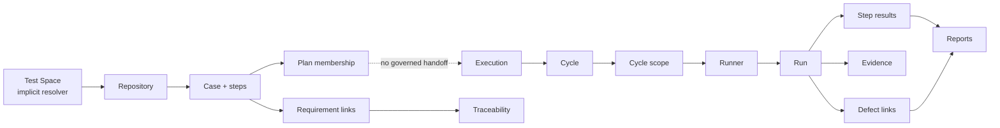

# Test Hub Current-State Revalidation

**Feature Work ID:** CAT-TESTHUB-REMEDIATION-20260711-001  
**Date:** 2026-07-11  
**Status:** Phase 1 revalidated — repository, live staging, automated tests, and a signed-in 15-route runtime sweep are documented; future-state design is Catalyst-native, while implementation-state screenshots remain pending

## Plain-language conclusion

Test Hub is not an empty prototype. It has real screens for cases, plans,
executions, cycles, runs, defects, traceability, and reports. A tester can create
and execute a case through the normal online happy path.

It is not production-ready because those screens do not form one reliably
connected, permission-safe lifecycle. The most serious breaks are:

1. There is no user-visible Test Space selector, and different pages can silently use different projects.
2. A Test Plan does not create or reliably seed an Execution and Cycle.
3. Several cycle/execution actions use wrong database fields and cannot work reliably.
4. Saving a run, its step results, evidence, scope status, and defect lineage is not atomic; partial records can remain.
5. Permissions are largely presentation-level. Live database access is permissive across projects.
6. Test evidence storage is public and unrestricted.
7. Removing/moving cycle scope can cascade-delete historical runs, results, and links.
8. Enterprise volume, offline recovery, archive/restore, version approval, reports, and certification coverage are incomplete.

## Evidence and limitations

| Evidence source | Result |
|---|---|
| Current source, routes, hooks, migrations, policies, and generated types | Revalidated read-only |
| Live staging database `cyijbdeuehohvhnsywig` | Revalidated read-only |
| Existing Test Hub unit suite | 3/3 tests passed; covers only execution deletion |
| Strict Test Hub color gate | 0 violations across 116 files; preserve this property |
| Focused Test Hub ESLint check | Failed: 147 errors and 213 warnings |
| Current app availability | User screenshot proves `localhost:8080` is running in signed-in Chrome |
| Signed-in screen navigation, console/network capture, current screenshots | Revalidated read-only in Chrome; 15 route screenshots are stored in `docs/testhub-remediation/visuals/live-20260711/` |
| Historical screenshots under prior feature folders | Useful context only; not accepted as current runtime proof |
| External research archive | Non-governing by owner direction; Catalyst canonical components and ADS are the sole design authority |

Status meanings:

- **Working** — current evidence proves the principal behavior.
- **Partial** — a useful path exists, but required scenarios or safety are absent.
- **Broken** — the implemented contract is wrong or cannot complete its principal job.
- **Missing** — no user-facing implementation was found.
- **Blocked** — current runtime proof cannot be obtained from this task.

## Actual current lifecycle

The dotted Plan-to-Execution connection is the central lifecycle break. Users
must manually recreate plan intent in later objects, so reports cannot prove
that the approved plan was what actually ran.

## Screen-by-screen functional ledger

| Journey/screen | Status | What works and must be preserved | What fails or is missing | Evidence |
|---|---|---|---|---|
| Test Space context | Broken | Resolver can remember a project ID | No visible switcher consumes `setProjectId`; resolver may choose the project with most cases; My Work uses `projects[0]` | `src/hooks/test-management/useTestHubProject.ts:21-105`; `src/modules/project-work-hub/adapters/testCasesDataSource.ts:97-105` |
| Dashboard | Partial | Canonical shared dashboard and Test widgets render | Widgets choose `projects[0]`; Test Hub personalization is disabled; active space is not guaranteed | `src/pages/testhub/DashboardPage.tsx:4-16`; `TestCasesOverviewWidget.tsx:16-21`; `DashboardWidgetGrid.tsx:127-161` |
| Board | Partial/Broken | Shared canonical Kanban surface | Create omits required `case_key`; archived cases are not excluded; delete is physical | `src/pages/testhub/BoardPage.tsx:4-17`; `useKanbanData.ts:372-386`; `useKanbanMutations.ts:269-282,456-476` |
| My Work | Partial | Shared Backlog/JiraTable view for assignee | Uses first project, default 25 records, and exposes hard delete | `src/pages/testhub/MyWorkPage.tsx:17-67`; `testCasesDataSource.ts:97-105,174-181` |
| Saved filters | Broken | Shared filter list/editor shell exists | Test mode still queries `ph_issues`, not Test Cases, so results and facets are wrong | `src/pages/testhub/FilterPreviewPage.tsx:621-641,712-738,827-859` |
| Repository list | Partial | Folder CRUD, search, JiraTable, create, AI create, copy, move, archive, add to cycle, detail panel | Default 25 records with no paging control; archive promises restore but offers none; exact-folder filtering conflicts with descendant counts | `RepositoryPage.tsx:738-1548`; `useTestCases.ts:52-57,102-106` |
| Repository folder UI | Partial | Nested organization and drag/drop behavior exist | Second hand-built tree/control system with raw interactions; should adapt the canonical tree | `RepositoryPage.tsx:315-534`; `src/components/wiki-hub/PageTree.tsx:30-137` |
| Create case | Partial | Case, steps, and labels can be written | Writes are separate; no initial version; hard-coded type/priority IDs can cross Test Spaces; no usable type picker | `useTestCases.ts:338-402` |
| Case detail | Partial | Canonical full-page detail; editable title/status/description/priority/assignee; steps, requirements, runs, files, activity, versions | Move says “Coming soon”; labels/fix versions/components are no-ops; ordinary edits bypass version snapshots | `CatalystViewTestCase.tsx:285-359,941-946` |
| Step authoring | Partial | Add, edit, reorder, duplicate, delete steps | Hand-built controls; no bulk paste, shared steps, parameter data model, or atomic aggregate save | `TestCaseStepsEditor.tsx:124-181,253-275`; `useTestSteps.ts:88-218` |
| Versions | Broken/Partial | Compare and restore records exist when snapshots exist | No initial snapshot, no visible New Version action, many edits do not snapshot, restore is multi-call and non-atomic | `CatalystViewTestCase.tsx:444-503`; `useTestCaseVersions.ts:137-200` |
| Case approval | Missing | Status can change | No approval record, reviewer role gate, enforced transition, or immutable approved version | `useCaseStatusConfig.ts:5-29`; `CatalystViewTestCase.tsx:302-313` |
| Archive/restore | Broken | Repository bulk archive exists | No show-archived/restore flow; Board/My Work have different deletion semantics | `RepositoryPage.tsx:1465-1494`; board/My Work evidence above |
| Test Sets | Broken navigation | Legacy routes correctly redirect to Plans | Sidebar still advertises Test Sets, a retired concept | `FullAppRoutes.tsx:698,705`; `TestHubSidebar.tsx:39-42` |
| Plans list | Partial | Create, rename, delete, JiraTable | Create captures name only, not objective, scope, entry/exit criteria, release, sprint, team, or dates | `TestPlansPage.tsx:62-124,318-350` |
| Plan detail | Disconnected | Add/remove case membership and lock toggle | No Create Execution action; no pinned case-version baseline; lock is a reversible UI flag and does not enforce membership immutability | `TestPlanDetailPage.tsx:105-168,270-335`; plan junction migration schema |
| Executions list | Partial/Hidden | Create/delete and JiraTable exist | Missing from sidebar; Product and Business Request scope types have no entity selector; no plan lineage | `ExecutionsPage.tsx:142-165,245-299`; `TestHubSidebar.tsx:35-47` |
| Execution detail | Broken | Complete and attach-cycle actions exist | Queries nonexistent `planned_start_date/planned_end_date`; attach has no plan/scope compatibility guard; no reopen/archive readiness workflow | `ExecutionDetailPage.tsx:52-129,214-222` |
| Cycles list/create | Partial | List, create, clone, archive/delete, bulk selection | Cycle and scope are separate writes; bulk delete has no confirmation; new cycles are not linked to plan/execution by contract | `CyclesPage.tsx:103-200,334-348`; `useTestCycles.ts:189-230` |
| Cycle detail | Broken/Partial | Scope, assignments, dates, filters, comments, evidence, defects, variance and start/complete controls exist | Bulk status/move writes wrong `status` column; move is non-atomic; project key ignored by resolver; completion has no terminal-scope guard | `CycleDetailPage.tsx:202-236`; `useTestCycleByKey.ts:5-24`; `useTestCycles.ts:620-646` |
| Runner online happy path | Partial/Working | Per-step Pass/Fail/Block/Skip/Hold, actual result, timer, evidence, force-pass reason and defect prompt exist | All-skipped becomes Passed; save is multi-call; client max+1 numbering races; no safe partial-save/resume contract | `ExecutionPage.tsx:122-138,602-744,819-1076` |
| Runner evidence | Broken/Partial | Online upload can create storage and metadata rows | Runner writes entity `test_run`; evidence panel queries `run`; storage and metadata are not one transaction | `ExecutionPage.tsx:701-720`; `CycleDetailPage.tsx:931-973` |
| Offline execution | Broken | A local queue exists | One global browser key, no user/project namespace, no idempotency, attachments discarded, result/scope errors ignored before dequeue, no manual retry state | `ExecutionPage.tsx:24-108,632-641` |
| Run retrospective | Partial | Run-level status, executor, time, notes and a defect field display | Does not fetch step results, actual results, or attachments; Hold falls back to Not Run; linked defects can be omitted | `useCompletedRunResults.ts:48-110`; `CycleRunDetailPage.tsx:90-180` |
| Defect creation | Partial | Online failed/blocked runs can prompt defect creation and lineage links | Defect then links are separate writes; orphan defects exist; only first requirement is linked; plan lineage is usually absent | `useDefects.ts:401-595` |
| Defects list/detail | Partial/Working | Canonical Backlog/detail surfaces exist | List context is not proven to use active Test Space; current live data includes unlinked defects | `DefectsPage.tsx:1-46`; `DefectDetailPage.tsx:1-34` |
| Traceability | Partial | Grid/hierarchy/matrix/canvas views and requirement links exist | Empty CTA can build an invalid route; two competing link tables can disagree; hierarchy controls are hand-built | `TraceabilityPage.tsx:86-179,319-570`; `runtime.ts:385-389` |
| Reports | Partial | Registry exposes 31 reports, charts, export and saved views | Several bodies hard-cap reads; main data path bypasses Plan/Execution; saved views omit full filters; source-of-truth reconciliation is unproven | `report-registry.ts`; `useRealTestReportData.ts:62-195`; `ReportsHubPage.tsx:59-85` |
| Timeline | Partial | Shared canonical TimelineView | Global/all-project data and deliberately disabled create/detail actions conflict with single-space operation | `TestHubTimelinePage.tsx:1-10,70-99` |
| Dependencies | Partial/Working | Shared canonical DependenciesView and core CRUD | Global scope and UUID-based values; active Test Space consistency unproven | `TestHubDependenciesPage.tsx:54-92` |
| Test priorities/types admin | Partial | CRUD exists | Raw HTML enterprise tables; authoring does not consistently consume configuration | `TestPrioritiesPage.tsx:179-248`; `TestCaseTypesPage.tsx:208-290` |
| Case statuses admin | Partial | Current lifecycle is visible | Read-only hard-coded lifecycle; custom workflows unsupported; UI sequence is not enforcement | `TestCaseStatusesPage.tsx:15-63,135-136` |
| Test permissions admin | Unsafe | Editable permission matrix writes records | Raw table; no audited screen path proves these permissions are enforced; database policies remain permissive | `TestPermissionsPage.tsx:52-100,130-199` |

## Live staging data integrity snapshot

| Metric | Current value |
|---|---:|
| Projects | 5 |
| Active test cases | 14 |
| Test steps | 35 |
| Case versions | 11 |
| Case labels | 0 |
| Plans | 2 |
| Plan-case links | 0 |
| Executions | 4 |
| Cycles | 5 |
| Cycles linked to executions | 4 |
| Cycles linked to plans | 0 |
| Cycle scope rows | 5 |
| Runs | 5 |
| Step results | 10 |
| Runs without results | 1 |
| Attachments | 1 |
| Defects | 22 |
| Defects without links | 4 |
| Requirement links | 2 |
| Comments | 0 |
| Activity events | 553 |

This is a material change from the 2026-07-07 certification handover, which
recorded 93 cases, 50 plan memberships, 144 step results, and 56 requirement
links after seed repair. The current environment no longer contains that
certification journey, so the old green result cannot certify today's state.

## Security and data-safety blockers

| Blocker | Current evidence | Production consequence |
|---|---|---|
| Project authorization effectively disabled | Live `tm_user_has_access` returns true for any authenticated user/project | Cross-project Test Hub access |
| Plan policies use `true` | Live and committed `tm_test_plans`/`tm_test_plan_cases` policies | Any signed-in user can alter every plan |
| Folder policies check authentication only | `20260109145821_...sql:7` | Cross-project folder read/write/delete |
| Evidence bucket is public | Live `testhub-attachments`: public, no size/MIME limits | Anonymous or cross-project evidence exposure and unsafe uploads |
| Six views lack `security_invoker` | Live Supabase advisor reports six ERROR-level views | Views can bypass caller RLS |
| Scope cascade destroys history | Scope → runs → results → defect links are cascading FKs | Move/remove can erase audit evidence |
| Multi-write workflows are client-side | Case, version restore, cycle creation, run save, evidence, defect linking | Partial and contradictory records after failure |
| Run number is max+1 without uniqueness | Runner client logic and live schema | Concurrent saves can duplicate run numbers |
| Attachment entity vocabulary differs | `test_run` versus `run` | Evidence disappears between screens |
| Stale generated types | `tm_test_executions`/`execution_id` absent; `typedQuery` casts to any | Schema mistakes bypass compile-time detection |
| Migration ledger collision | Two files use `20260706120000` | Fresh replay and environment parity are unsafe |
| Plaintext fallback credential committed | `tests/testhub-certification/auth.setup.ts:3` | Credential exposure; rotate and remove without reproducing secret |

## Canonical UI baseline

The shell should be remediated, not replaced. Existing proven canonicals include:

- Dashboard: `ProjectDashboardPage`
- Board: `KanbanPage`
- My Work and Defects: `BacklogPage` + `JiraTable`
- Repository, Plans, Executions, Cycles, run list: `JiraTable`
- Case and Defect detail: `CatalystDetailRouter` / `CatalystViewBase`
- Timeline: `TimelineView`
- Dependencies: `DependenciesView`
- Comments: `TmCommentsSection` → canonical `CommentThread`
- Reports: shared `ReportChart`, status view, export menu, save modal

Current component usage is mixed: 22 JiraTables, 13 ProjectPageHeaders, 22 ADS
modals, 85 ADS buttons, and 85 lozenges coexist with 72 raw buttons, 20 raw
inputs, 4 raw textareas, 2 raw selects, and 3 raw tables. Highest-priority
component drift is the shadcn AI generation dialog, raw admin tables,
repository/step authoring, runner controls/evidence, cycle side panels, report
filters/navigation, and traceability controls.

## What is proven working and must not regress

1. Module gating and all registered Test Hub routes exist.
2. Shared canonical shells are already used for the dashboard, board, backlog, tables, details, timeline, and dependencies.
3. Folder and case happy-path CRUD exists.
4. Online step execution supports the main verdict controls, actual result, notes, timer, and evidence selection.
5. Defect creation and link insertion work in the normal online path when every call succeeds.
6. Traceability and 31 report routes have real data hooks rather than static mock pages.
7. Strict Test Hub hard-coded-color gate is green and must remain green.
8. The execution-deletion guard has a passing three-test unit suite.

## Newly confirmed findings

- The focused Test Hub source scope has 360 lint findings despite passing the color gate.
- Current live staging has lost the earlier seeded certification chain.
- Six live Test Hub views are flagged as security-definer errors.
- The evidence bucket is public with no file restrictions.
- One live run has no step results, directly demonstrating partial-write risk.
- Historical visual evidence is mostly prototype/historical and cannot certify today's `/testhub/*` routes.

## Automated-certification reality

| Coverage type | Current proof |
|---|---|
| Unit | One hook suite: 3 passing execution-delete tests |
| Current Playwright | 17 listed tests including setup; route checks are shallow and the case-create test mutates shared staging without cleanup |
| Legacy Playwright | 12 tests target obsolete `/projects/:uuid/tests/*` routes and port 5173 |
| Database/RLS | No Test Hub policy suite |
| Accessibility | No Test Hub journey coverage |
| Visual regression | No current `/testhub/*` baselines |
| Offline/sync | None |
| High-volume/pagination | None |
| Performance | None |
| CI | Runs unit/build/color checks; does not run Test Hub Playwright |

The auth probe does not assert successful authentication. The navigation suite
does not fail on console/network errors and proves only that a route is not blank
or an error boundary. This is useful smoke coverage, not functional certification.

## Blocked verification still required

Once signed-in browser control is available, Phase 1 must still navigate every
route and capture full-screen, console, and network evidence for:

- loading, empty, populated, error, and permission-denied states;
- Test Space consistency across every page;
- create/edit/archive/restore and version/approval behavior;
- Plan → Execution → Cycle handoff;
- every runner result, partial save/resume, retry, concurrency, and offline sync;
- attachment upload/download/delete;
- failure-to-defect lineage and run retrospective;
- traceability and report reconciliation;
- keyboard navigation, focus behavior, accessibility, high volume, responsive layout, and visual regression.

No current runtime screenshot claim will be marked verified until that sweep is
performed against the actual `/testhub/*` routes.
