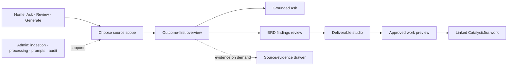

# Doc Intel UI Revamp Study

**Feature Work ID:** CAT-DOCINTEL-V2-20260709-001
**Date:** 2026-07-11
**Mode:** Read-only product discovery and council; no implementation
**Evidence level:** High — repo, live Catalyst, live staging schema/data, supplied screenshots,
signed-in Rovo/Jira, Mobbin flows, and first-party product documentation

## Executive verdict

Doc Intel is not a page extractor. It is already an evidence-to-delivery engine:

```text
trusted sources
  → grounded understanding and Ask
  → reviewable findings and requirements
  → cited BRD / backlog / test deliverables
  → human approval
  → linked Catalyst/Jira work
```

The UI currently exposes that engine as seven implementation-shaped tabs — Evidence, Document,
Facts, Artifacts, Traceability, Ask, and Links — with Evidence first. This is why a real and capable
system feels purposeless. The user has to understand the backend model before reaching the outcome.

The recommended product contract is:

> **Review a BRD and turn accepted findings into traceable delivery work.**

The broader promise, after that contract is proven, is:

> **Turn trusted source material into cited answers, decision-ready documents, and governed work.**

Rovo is the right reference for the front door, but not for the whole product. The recommended
direction is a **BRD Review Workbench on the existing Doc Intel substrate**, not a Rovo clone.

## What Doc Intel really offers today

| User job | Delivered capability | Evidence |
|---|---|---|
| Add knowledge | PDF, DOCX, XLSX, PPTX, image and audio ingestion; Folio attachment ingestion | `DocintelUploadPage.tsx:38-50`, `DocexAttachments.tsx:85-120` |
| Understand content | Native extraction, OCR/audio transcription, English/Arabic translation, structured reading view | `docintel-analyze/index.ts:418-598,784-855,1080-1341` |
| Ask with trust | Document/project/theme-scoped bilingual RAG with cited quotations, page anchors, freshness and refusal when evidence is absent | `AskPanel.tsx:155-417`, `docintel-ask/index.ts:322-522` |
| Review knowledge | Extract and review capabilities, actors, workflows, requirements, constraints, risks, assumptions and open questions | `FactsReviewPanel.tsx:161-313`, `factKinds.ts:15-25` |
| Create deliverables | 12 cited outputs including Full BRD, Epic, stories, gap analysis, acceptance criteria, test cases and traceability matrix | `artifactTypes.ts:30-42`, `docintel-generate/index.ts:48-214` |
| Govern outputs | Grounding warnings, approve, reject with reason, audit trail | `ArtifactView.tsx:194-383`, `governance.ts:56-98` |
| Turn evidence into work | Preview and promote Epic/story proposals, assign owners, link created work to source documents | `PromoteArtifactModal.tsx:94-287` |
| Trace decisions | Source → fact/artifact → page → linked delivery work | `TraceabilityMatrix.tsx:119-267`, `DocumentLinksPanel.tsx:105-555` |
| Organize a corpus | Project scope, themes, document tagging, theme-filtered Ask | `ThemeTags.tsx:25-115`, `DocintelDocumentsPage.tsx:87-97,236-316` |
| Operate safely | Health, failures, queue/sync, re-index, audit, RLS and scheduled self-heal | `DocintelHealthPage.tsx:274-560`, `docintel-sync/index.ts:4-43` |

Live staging snapshot on 2026-07-11:

- 31 ready sources: 25 Jira, 4 uploaded documents, 2 git.
- 5 generated artifacts: 4 verified, 1 promoted.
- 5 extracted facts, all still unreviewed.
- 1 theme.

The current library does not reveal source type, so 27 Jira/git sources appear to users as generic
documents. This is a material product and trust gap, not merely a visual issue.

## Why the current journey fails

### The page answers backend questions, not user questions

| Current foreground | What a user actually wants to know |
|---|---|
| Ready, page count, language, uploaded time, duration | What can this source help me decide or create? |
| Page 1 / Extracted / confidence / duplicated prose | What does this document mean and what needs attention? |
| Evidence first | Can I ask, review, compare, or build a BRD? |
| Twelve flat artifact buttons | Which outcome should I create for this job, and what is it based on? |
| Facts / Traceability / Links as peer tabs | What are the findings, have they been reviewed, and what work resulted? |
| Knowledge Health in the user header | Is my task ready, blocked, or in need of action? |

### Live UX findings

- The library is an operations inventory. Every row says READY; source type and useful next actions
  are absent.
- Project Ask opens a narrow drawer over the inventory with no history, source selection, job
  starters, or explanation of scope.
- The document workspace defaults to raw extracted evidence and uses seven equal-weight tabs.
- The Ask tab is a single-line field in a mostly empty canvas.
- The Artifacts tab is a strip of 12 buttons and a generic Generate button.
- Knowledge Health leaks embeddings, queue state, provider failures and billing errors to the normal
  user journey.
- At a 1680×894 viewport, the Health attention table exceeds its content width and creates
  horizontal overflow.
- JiraTable accessibility names include repeated resize controls, making rows unnecessarily verbose
  to assistive technology.

The supplied Screenshot 2 matches the live default Evidence state exactly.

## User-facing versus admin-facing information

### Keep user-facing

- Concise cited answers and summaries.
- Exact supporting quotation, page/section, source and version on citation click.
- Active source scope and freshness.
- Findings that a BA/QA/PO can accept, edit or reject.
- Artifact review state, unresolved questions and grounding warnings in plain language.
- Traceability from accepted finding to deliverable and work item.
- Bilingual and side-by-side review.

### Move to Admin or an advanced source inspector

- Raw page/block extraction, OCR flags and duplicated extracted prose.
- Chunk/embedding counts, prompt/model provenance and token/latency telemetry.
- Jobs, queues, retries, stuck items and provider error payloads.
- Manual adapter refresh, rebuild controls and processing audit events.
- Low-level block UUIDs and internal confidence calculations.

**Important correction:** citations themselves must not move to Admin. They are Doc Intel's strongest
user-facing trust contract. Only the technical citation machinery should be hidden.

## Top-five benchmark

The comparison set was selected for distinct product lessons, not popularity. Notion and Sana were
inspected but excluded from the final five because their strongest patterns overlap with Rovo and
NotebookLM; Elicit and Productboard add more important rigor and work-conversion lessons.

### 1. Atlassian Rovo — best front door and Find → Learn → Act model

Observed: dominant intent composer, source/app affordances, recent work, contextual results and
actions. Rovo's official model is Find, Learn and Act across permission-aware sources.

Adopt:

- A single dominant composer on Home.
- Recent work and resumable context below it.
- Visible source scope and task starters.
- Action after understanding, not chat as an endpoint.

Do not copy:

- A generic blank chat that assumes users know the right prompt.
- An agent selector before governed Doc Intel jobs are mature.

References: [Rovo overview](https://support.atlassian.com/rovo/docs/what-is-rovo/),
[Rovo features](https://www.atlassian.com/software/rovo/features).

### 2. NotebookLM — best bounded source-grounded workspace

Observed: Sources / Chat / Studio remain simultaneously legible; source checkboxes determine scope;
citations remain beside the answer; generated outputs are separated from conversation.

Adopt:

- Persistent sources/context rail.
- Ask in the working context, not as a detached tab.
- Separate deliverables from chat while preserving citations.
- Clear first-run explanation of the benefit.

Do not copy:

- Equal three-pane density at every viewport.
- Generic outputs without enterprise review/approval.

Mobbin: [Creating a notebook](https://mobbin.com/flows/a9ac908a-cd81-47d4-b929-be83ec5c9501),
[research workspace screen](https://mobbin.com/screens/4ec5d892-18bd-4dec-a034-b69ab836da2b).
Official: [NotebookLM sources](https://support.google.com/notebooklm/answer/16215270),
[grounded citations and Studio](https://support.google.com/notebooklm/answer/16164461).

### 3. Elicit — best rigorous review pipeline and structured extraction

Observed: the user defines a question and explicit criteria; the system shows gather → screen →
extract → report as a controlled workflow; structured rows retain supporting quotes and can be
overridden by a human.

Adopt:

- A BRD review lens with explicit evaluation criteria.
- Reviewable structured findings, not a prose dump.
- Human override and visible supporting evidence.
- Progress stages only when they help the task, not as the product homepage.

Do not copy:

- Scientific-review terminology or dense extraction tables for every document.
- False precision from model-generated criteria scores.

Mobbin: [Extracting data from PDFs](https://mobbin.com/flows/8adfa568-bea4-4f12-a90f-549fa45ac6dd),
[structured review screen](https://mobbin.com/screens/cbb8f804-3f26-46d6-adc0-55049357021a).
Official: [systematic-review workflow](https://elicit.com/solutions/literature-review),
[transparent cited reports](https://elicit.com/blog/introducing-elicit-reports).

### 4. Dovetail — best evidence → theme → reviewed insight model

Observed: summaries, themes and raw evidence stay connected; citation clicks return to the source;
AI and human contribution are distinguishable; insights become durable review objects.

Adopt:

- A finding as a governed object: claim, evidence, review state, reviewer, decision and downstream
  action.
- Themes that organize accepted evidence/findings, not just tag files.
- Source evidence in a contextual drawer.

Do not copy:

- Theme-count dashboards.
- Treating automatic clustering as an approved conclusion.

Mobbin: [document insights screen](https://mobbin.com/screens/d6444330-dbfb-49ab-bd3e-c9f9715aee5d),
[source-and-topics screen](https://mobbin.com/screens/cc66f0c7-68b3-4dd9-8cdb-0dd8ecb8c592).
Official: [contextual citations](https://dovetail.com/changelog/citations-for-contextual-chat/),
[customer intelligence platform](https://dovetail.com/).

### 5. Productboard — best reviewed insight → planned work handoff

Observed: users select exact evidence snippets, connect them to the product hierarchy and review the
link before treating it as planned work.

Adopt:

- Create/link work beside an accepted finding or approved deliverable.
- Preview the target project/type/fields and exact evidence backlink.
- Persist bidirectional traceability.

Do not copy:

- Manual linking as clerical work for every extracted sentence.
- Auto-creating delivery work from unreviewed AI extraction.

Mobbin: [Adding feedback](https://mobbin.com/flows/923c578d-2117-46d5-8468-a5c54da78692),
[Linking an insight](https://mobbin.com/flows/8ca8356a-1c55-4892-943f-5bcfd2f1547f).

## Proposed user journey and screens



### A. Home / For you

- Prompt: “What do you need to understand, review, or produce?”
- Modes: Ask, Review, Generate.
- Job starters: Review a BRD, find missing requirements, find conflicts, generate delivery plan,
  build test readiness.
- Source scope adjacent to the composer: project, document(s), theme, Jira, git.
- Recent documents and deliverables; do not call them “analyses” until analyses persist.
- Quiet task state: ready, needs review, blocked — no embeddings or provider telemetry.

### B. New BRD review

Three decisions maximum:

1. Choose the BRD review job/template.
2. Select sources and versions.
3. Confirm expected output and start.

The processing state shows meaningful stages and recovery only while work is running.

### C. Outcome-first document overview

- Executive summary.
- What needs attention.
- Requirements and decisions found.
- Open questions and risks.
- Review progress and next best action.
- Persistent Ask composer and Source Scope Strip.
- Raw extraction absent from the default.

### D. BRD findings review

- Groups: Requirements, risks, assumptions, open questions, conflicts, and gaps only where the
  current data can prove the classification.
- JiraTable as the canonical enterprise review list.
- Each finding: statement, kind, evidence count, source, review state, reviewer action.
- Accept / reject / reset using the existing fact workflow; edit requires a separately proven
  data contract.
- Citation opens an evidence drawer at the exact source anchor.

### E. Grounded Ask

- Conversation is central within the workspace, with visible source scope and freshness.
- Inline citations open the evidence drawer and return focus on close.
- Suggested questions are job-specific.
- “Not found in sources” remains a valid answer.
- Conversation persistence is deferred; the UI must not pretend that local history is durable.

### F. Deliverable Studio

- Outcomes grouped by job: BRD, delivery planning, quality/test, decision communication.
- Recent/generated deliverables are durable list items with review state and citation coverage.
- Deliverable view: readable cited content, approve/reject, export and promote.
- Rich editing is deferred until ADF storage/conversion is Plan-Locked; do not ship a fake editor.

### G. Promote to work

- Only approved artifacts or accepted findings are eligible.
- Preview target project, issue type, fields, assignments and evidence backlinks.
- Work creation cannot report complete success if provenance linking fails.
- Partial success must show failed links and an explicit retry/recovery path.

### H. Library

- Separate source identity: uploaded document, Jira issue, git file.
- Filters: project, theme, type, freshness, needs review and deliverable state.
- Show useful status rather than READY repeated on every row.
- Existing slug URLs remain valid.

### I. Admin / Operations

- Sources and ingestion.
- Processing/OCR/extraction inspection.
- Knowledge health, queue and sync.
- Prompt/model registry.
- Audit and retries.
- Admin UI and backend enforcement are both required; `AdminGuard` alone is not security.

## Recommended information architecture

User-facing:

```text
Home
Library
Themes
Deliverables

Document workbench
  Overview
  Ask
  Findings
  Deliverables
  Work items

Contextual drawers/actions
  Sources and evidence
  Versions
  Traceability
```

Admin:

```text
Document Intelligence
  Sources, ingestion and raw extraction
  Processing health
  Audit and retries

Deferred behind separate permission work
  Prompts and models
```

The prompt/model destination is architectural direction, not part of the executable v2.1 build.
The current prompt-table policy must be secured by a separate RLS/grant Plan Lock first.

## Blind spots that change the plan

1. **There is no persisted analysis or conversation.** Ask history is component state. A Home with
   “recent analyses” would be a lie; use recent sources/deliverables in Phase 1.
2. **The UI hides source identity.** `source_type` exists in the DB but not in the frontend document
   type or current list.
3. **Jira/git citations cannot deep-link.** Current citation metadata lacks source type, Jira key/URL,
   git path/revision and section/line anchor.
4. **Jira/git sync recreates identities.** Delete-and-recreate adapters risk broken citations,
   themes and links; a user-facing sync promise requires identity-preserving upsert.
5. **Git is an adapter, not a connector.** It accepts caller-provided paths/content; no provider
   auto-fetch exists.
6. **Version history is display-only.** Do not promise Compare versions until a real diff exists.
7. **Generation is single-document in the UI.** The API accepts multiple IDs, but the component
   always sends one.
8. **Artifacts are not standalone workspaces.** They cannot be deep-linked or resumed.
9. **There is no BRD editor.** Approve/reject/promote is real; collaborative edit is not.
10. **Draft artifacts can currently be promoted.** This breaks the claimed human-review boundary.
11. **Provenance links are best-effort after work creation.** The UI can report success even when
    source linkage fails.
12. **Admin separation is not enforced.** Any authenticated user can reach Health/re-sync; prompt
    rows are selectable by every authenticated user; several public `SECURITY DEFINER` Doc Intel
    functions have broad EXECUTE grants.
13. **Theme and artifact review permissions are membership-based, not role-based.** The new UI
    cannot claim governed reviewer/admin roles without backend enforcement.
14. **Current styled files carry targeted ADS debt.** Ratchets pass, but the strict Doc Intel audit
    reports 43 violations. Any touched file must leave the gate cleaner, not copy the debt.
15. **Citations are a differentiator, not telemetry.** Moving them to Admin would remove the product's
    strongest reason to trust it.

## Options considered

| Option | Description | Effort | Risk | Verdict |
|---|---|---:|---:|---|
| A — Rovo skin | New greeting/composer/recent list; keep current downstream tabs and local Ask | Low | High product risk | Reject as target |
| B — BRD Review Workbench | Job-led Home, BRD-first workflow, outcome Overview, Findings, Deliverables, governed handoff, Admin separation, existing engine preserved | Medium | Medium | **Recommended** |
| C — Persistent analysis platform | New analysis entity, durable chat, collaboration, true multi-source/version diff, monitoring | High | High | Defer until B is proven |

## Accept / reject / defer

### Accept now

- Job-led Rovo-like Home.
- BRD Review Workbench on the existing substrate.
- Outcome-first Overview.
- Source Scope Strip.
- Evidence-on-demand drawer.
- Findings review and a Review Dossier/Decision Ledger.
- Approved-only Jira handoff with honest partial-failure recovery.
- User/Admin separation with real backend authorization.
- Bilingual review as a first-class user workflow.

### Defer

- Persisted analysis/conversation entity.
- True multi-document and version comparison.
- Collaborative annotations, mentions and assignments.
- Rich ADF artifact editing until storage/conversion is designed.
- Reusable template marketplace/agent personas.
- Interactive lineage graph and continuous impact monitoring.

### Reject

- Pixel-cloning Rovo.
- Generic blank chat as the product.
- Extraction/confidence dashboards in the user journey.
- Unreviewed Jira auto-creation.
- Decorative readiness scores or theme-count analytics.
- Rename-only redesign.

## Binary product acceptance criteria

- [ ] Home explains the outcome and offers Ask / Review / Generate without training.
- [ ] A user starts a BRD review in no more than three decisions.
- [ ] Opening a source never defaults to raw extracted-page telemetry.
- [ ] All seven existing capabilities remain reachable; the revamp is additive/neutral.
- [ ] Every cited claim opens its exact source anchor and version where available.
- [ ] Ask shows active scope and freshness before and after submission.
- [ ] Findings retain review state, reviewer and provenance.
- [ ] Promotion is unavailable until the governing artifact/finding is approved.
- [ ] Provenance-link failure cannot be reported as full success.
- [ ] Extraction, prompt, provider and job diagnostics are absent from the primary journey and
      available under a backend-enforced Admin surface.
- [ ] Uploaded document, Jira and git sources are visually distinct.
- [ ] Arabic Ask, reading, citations and review interactions pass RTL visual/keyboard checks.
- [ ] Existing routes, Folio ingestion, export, themes, version upload, citations, review, promotion,
      links and scheduled sync regressions are all tested.

## One non-negotiable

Lock the first user contract to **“Review a BRD and turn accepted findings into traceable work.”**
Do not design Slice 1 for “any documentation,” and do not begin implementation until the revised
Plan Lock is approved.
