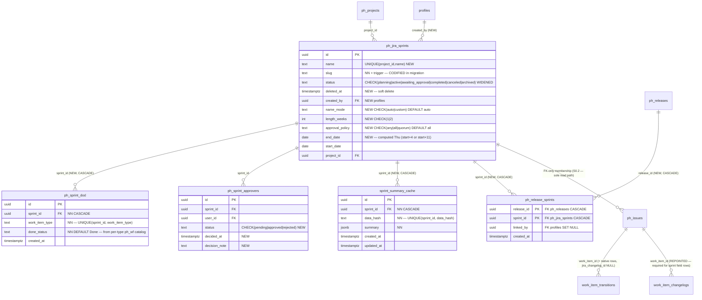

# A5 — Data/Safety Guard: ERD + Migration Safety Report
**Feature:** CAT-SPRINTS-NATIVE-20260702-002 · **Agent:** Data/Safety Guard · **Date:** 2026-07-02
**Sources:** repo migrations (`supabase/migrations/`), `src/integrations/supabase/types.ts`, live-DB probe evidence in `13_COUNCIL_VERDICT.md` (staging `cyijbdeuehohvhnsywig`, prod `lmqwtldpfacrrlvdnmld`).

---

## 1. AS-IS ERD (column-level, sprint domain)

Legend: `--` solid = real FK · `..` dashed = name-based soft link (no FK) · `[DEAD]` = legacy/dead table (candidates for eventual retirement, untouched by this feature).

Column provenance notes:
- `ph_jira_sprints.slug`, `section_name`, `section_description_adf` exist on **staging + types.ts but in NO checked-in migration** (out-of-band patch; the slug migration `20260701000008_sprints_slugs.sql` targeted the WRONG table — legacy `public.sprints`). `deleted_at` does **not** exist anywhere, yet `useSprintBySlug.ts:15` filters `.is('deleted_at', null)` → broken today.
- `ph_issues` has **no `sprint_id`** — its only sprint linkage is `sprint_name` (text, wiped by Jira sync) and `sprint_release` (JSONB).
- `work_item_transitions.work_item_id` FK was repointed to `ph_issues(id)` (`20260620130000`). `work_item_changelogs.work_item_id` FK **still points at `public.work_items`** (empty AI table) per checked-in migrations — see §7 finding F6.

```mermaid
erDiagram
    ph_projects ||--o{ ph_jira_sprints : "project_id (CASCADE)"
    ph_jira_sprints ||--o{ ph_sprint_approvers : "sprint_id (CASCADE)"
    profiles ||--o{ ph_sprint_approvers : "user_id (CASCADE)"
    ph_jira_sprints }o..o{ ph_issues : "name-match: ph_issues.sprint_name = sprints.name (soft)"
    ph_jira_sprints }o..o{ ph_issues : "JSONB-match: ph_issues.sprint_release[].name (soft, via vw_sprint_jira_progress)"
    ph_jira_sprints ||--o{ stories : "sprint_id (nullable)"
    ph_jira_sprints ||--o{ features : "sprint_id (SET NULL)"
    ph_jira_sprints ||--o{ incidents : "sprint_id (SET NULL)"
    ph_jira_sprints ||--o{ ph_work_items : "sprint_id (SET NULL)"
    ph_jira_sprints ||--o{ tm_test_cycles : "sprint_id (SET NULL)"
    ph_jira_sprints ||--o{ tm_test_plans : "sprint_id (SET NULL)"
    ph_jira_sprints ||--o{ tm_test_cases : "sprint_id (SET NULL)"
    ph_jira_sprints ||--o{ tm_defects : "sprint_id (SET NULL)"
    ph_issues ||--o{ work_item_transitions : "work_item_id (CASCADE, repointed 20260620)"
    work_items_DEAD ||--o{ work_item_changelogs : "work_item_id (CASCADE — STALE FK, see F6)"
    ph_issues }o..o{ catalyst_status_history : "issue_key text (soft)"
    ph_projects ||--o{ ph_releases : "project_id"
    ph_wf_schemes ||--o{ ph_wf_scheme_entries : "scheme_id"
    ph_wf_versions ||--o{ ph_wf_scheme_entries : "version_id (entity_key='sprint')"
    ph_wf_versions ||--o{ ph_wf_version_statuses : "version_id"
    ph_wf_versions ||--o{ ph_wf_version_transitions : "version_id"
    ph_wf_version_transitions ||--o{ ph_wf_transition_guards : "transition_id"
    ph_wf_versions ||--o{ ph_wf_status_remaps : "to_version_id"
    ph_jira_sprints }o..o{ ph_wf_version_statuses : "status text vs status_key (advisory, A-lite — no FK)"

    ph_jira_sprints {
        uuid id PK
        text name "NOT NULL"
        text title "NOT NULL"
        text description
        text status "NN DEFAULT planning CHECK(planning|in_progress|released|archived)"
        date start_date
        date target_date "NOT NULL"
        date actual_date
        date release_date
        uuid owner_user_id "no FK"
        text color "DEFAULT #2563eb"
        int sort_order
        uuid project_id FK "ph_projects CASCADE"
        text jira_sprint_id
        text slug "STAGING-ONLY drift: NN in types, NO migration"
        text section_name "staging drift"
        jsonb section_description_adf "staging drift"
        timestamptz created_at
        timestamptz updated_at
    }
    ph_sprint_approvers {
        uuid id PK
        uuid sprint_id FK "NN CASCADE"
        uuid user_id FK "NN profiles CASCADE"
        text status "NN DEFAULT pending — NO CHECK"
        text description
        uuid added_by "no FK"
        timestamptz created_at
        timestamptz updated_at
    }
    ph_issues {
        uuid id PK
        text issue_key "UNIQUE"
        text project_key "NN"
        text sprint_name "soft link — Jira sync overwrites"
        jsonb sprint_release "fix-versions+sprints JSONB — soft link"
        text status "NN"
        text status_category "NN"
        text parent_key
        text assignee_account_id
        text sync_status
    }
    ph_releases {
        uuid id PK
        text name "NN"
        text title "NN"
        text status "NN CHECK(planning|in_progress|released|archived)"
        date start_date
        date target_date "NN"
        date release_date
        uuid owner_user_id
        uuid project_id FK
        text slug "NN (migrated 20260701000011)"
    }
    work_item_transitions {
        uuid id PK
        uuid work_item_id FK "NN ph_issues CASCADE"
        text from_status
        text to_status "NN"
        text from_status_category
        text to_status_category "NN"
        text transitioned_by "NN DEFAULT Unknown"
        text transitioned_by_avatar
        timestamptz transitioned_at "NN"
        bigint time_in_from_status_ms
        text jira_changelog_id "UNIQUE(work_item_id, jira_changelog_id); NULLs distinct = native rows OK"
        timestamptz created_at
    }
    work_item_changelogs {
        uuid id PK
        uuid work_item_id FK "NN — STILL FKs work_items (stale)"
        text jira_changelog_id "UNIQUE(work_item_id,jira_changelog_id,field_name)"
        text field_name "NN — 0 rows with sprint on staging"
        text field_type "DEFAULT jira"
        text from_value
        text to_value
        text changed_by "NN DEFAULT Unknown"
        timestamptz changed_at "NN"
    }
    catalyst_status_history {
        uuid id PK
        uuid issue_id "no FK"
        text issue_key "soft link; idempotent unique idx"
        text from_status
        text to_status
        timestamptz changed_at "NN"
        uuid changed_by FK "auth.users"
        jsonb metadata
    }
    profiles {
        uuid id PK
        text full_name
        text email
        text avatar_url
        text jira_account_id
    }
    stories {
        uuid id PK
        uuid sprint_id FK "nullable, pre-existing"
        text story_key
        text status "enum story_status"
        timestamptz deleted_at
    }
```



### Dead / legacy tables (mark for eventual retirement — DO NOT touch in this feature)
| Table | Origin | Shape | Why dead |
|---|---|---|---|
| `sprints` | **no checked-in CREATE** (drift); altered by `20260701000008_sprints_slugs.sql` | id, name, project_id, slug NN, status, created_at | The slug/trigger/dedupe migration landed HERE instead of `ph_jira_sprints` — root cause of the broken `useSprintBySlug` |
| `iterations` | pg_dump `20251211141446` | pi_id NN, team_id, name, start/end, goal, sync_date | SAFe PI-era artifact |
| `product_sprints` | `20260612100000` | release_id FK→product_releases, name, dates | Product-hub prototype |
| `release_sprints` | `2026-06-28_007` | release_id FK→`releases`, sprint_id FK→`sprints`, artifact_count | Junction between two legacy tables |
| `rh_release_sprints` | `20260618120000:208` | release_id FK→rh_releases, sprint_id FK→**anchor_sprints**, project_id, linked_by, linked_at, UNIQUE(release_id,sprint_id) | Release-hub ops prototype — **design template for TO-BE `ph_release_sprints`** |
| `anchor_sprints` | pg_dump `:2007` | code NN, name NN, start/end NN, program_increment_id | SAFe anchor cadence |
| `wh_sprint_releases` | rename of `wh_fix_versions` (`20260602100000`) | fix-version mirror | Workstream-hub Jira mirror, not a sprint entity |

---

## 2. TO-BE ERD (verdict additions)



TO-BE notes:
- `work_item_transitions` gains **native rows** (`jira_changelog_id IS NULL`) via a status-update trigger/hook — the existing `UNIQUE(work_item_id, jira_changelog_id)` is safe because Postgres treats NULLs as distinct (unlimited native rows allowed, Jira idempotency untouched).
- `vw_sprint_jira_progress` repointed from JSONB/name match to `sprint_id` FK (S0.2), and must add `WHERE s.deleted_at IS NULL`.
- Verdict status model **conflicts with the seeded ph_wf Sprint SDLC remap**: verdict keeps `archived` as a terminal status; `20260629010000` remaps `archived→canceled` and has no `awaiting_approval`/`archived` status keys. The ph_wf catalog needs a v2 version (add `awaiting_approval`, keep `archived`) or the DoD flow will read a catalog that disagrees with the DB CHECK. Flag to Plan Lock.

---

## 3. RLS audit

### Current policies (verbatim from migrations)
| Table | Policy | Role | Effect |
|---|---|---|---|
| `ph_jira_sprints` (`20260626000000`) | "Anon read sprints" SELECT | `anon` | anon can read all sprints |
| | `sprints_read_all` SELECT | `authenticated` | read all |
| | `sprints_write_all` ALL USING(true) WITH CHECK(true) | `authenticated` | **any authenticated user can write/delete any sprint** — no project-membership gate |
| `ph_sprint_approvers` (`20260626040000`) | select/insert/update/delete, all `USING(true)` | **none (= `public`)** | **anon can INSERT/UPDATE/DELETE approval rows** — approval integrity is unenforced at DB level |
| `work_item_transitions` (`20260309231334:23`) | "Allow all access to transitions" FOR ALL USING(true) WITH CHECK(true) | **none (= `public`)** | **anon can write/delete transition history** — the audit trail every Phase-3 metric depends on is forgeable |
| `work_item_changelogs` (`20260610000100`) | select→`authenticated`; **no write policy** (service-role only) | | correct model — the template to copy |
| `catalyst_status_history` (`20260219`) | read→`authenticated` | | reads OK; writes service-role |
| `ph_issues` | (probe evidence) anon count = 0 | | **anon-blocked** → `vw_sprint_jira_progress` (security_invoker) returns zero rows to anon even though sprints are anon-readable — inconsistent surface; and all linkage-count probes MUST use service role |

### Required policy work
1. **Fix in this feature (same slice as M4):** `ph_sprint_approvers` — re-create all 4 policies `TO authenticated`; consider UPDATE restricted to `user_id = auth.uid()` for the decision columns (approver can only decide own row) + INSERT/DELETE to authenticated (or sprint creator).
2. **Fix before Phase 3 analytics (same slice as M8 native write path):** `work_item_transitions` — drop "Allow all access"; SELECT `TO authenticated`; writes via SECURITY DEFINER trigger function or service-role only (mirror the 20260610 changelogs pattern). Metrics on a forgeable table violate the audit-trail standard (#4 in the verdict).
3. **New tables:**
   - `ph_sprint_dod`: SELECT `authenticated`; INSERT/UPDATE/DELETE `authenticated` (tighten to project membership when the ACL model lands). No anon.
   - `ph_release_sprints`: SELECT `authenticated`; INSERT/DELETE `authenticated`. No anon.
   - `sprint_summary_cache`: SELECT `authenticated`; **no write policy** — edge function writes with service role (clone board_insight_cache's footprint).
4. **Decide:** keep or drop "Anon read sprints". If the app never renders sprints unauthenticated, drop it for symmetry with ph_issues (currently anon sees sprint shells but zero progress — a confusing half-open surface).

---

## 4. Migration risk register

| # | Migration (verdict order) | Risk | Reversible? | Staging | Prod | Notes |
|---|---|---|---|---|---|---|
| M1 | `ph_jira_sprints`: **codify slug + section_* (already live) as no-op-guarded DDL**, add `deleted_at, created_by, name_mode, length_weeks, approval_policy, end_date`; `UNIQUE(project_id, name)`; slug trigger; fix `useSprintBySlug` | LOW (additive; IF NOT EXISTS guards make the live-drift columns converge) | YES — drop columns/index | REQUIRED | **BLOCKED — see RED FLAG below** | UNIQUE(project_id,name) needs a pre-check: 26 existing names must not collide (old naming convention → verify count first) |
| M2 | FK backfill (`sprint_id` from `sprint_release` JSONB/name), repoint `WorkItemsSection` + `vw_sprint_jira_progress` to FK, neuter Jira-sync writes to `sprint_name` for native sprints | **HIGH** | PARTIAL — FK columns nullable and name columns retained, so data reverts cleanly; the **edge-function change is code, not SQL** — revert via git | REQUIRED | after drift resolution | **Precondition:** service-role linkage-count probe (anon sees 0 ph_issues rows — verdict caveat). Count-verify: rows matched by JSONB vs name vs both, before and after |
| M3 | Status vocabulary: widen CHECK + map `in_progress→active`, `released→completed` | MEDIUM | ONLY with snapshot — mapping is lossy-free forward but the reverse (`completed→released`) can't distinguish original `released` from future native `completed`. Write old values to a one-off audit table or `metadata` before UPDATE | REQUIRED | after drift resolution | Exact ALTER in §6. Must land **in the same slice** as the code-vocabulary changes (§6 file list) or every sprint pill/filter breaks |
| M4 | `ph_sprint_dod` + seed defaults; approvers CHECK(pending\|approved\|rejected) + `decided_at`, `decision_note`; **fix approvers RLS (TO authenticated)** | LOW-MEDIUM | YES — drop table/constraint/columns | REQUIRED | after drift resolution | CHECK is safe: staging `ph_sprint_approvers` has 0 rows (probe). Guard anyway with `NOT VALID` + `VALIDATE CONSTRAINT` |
| M5 | `ph_release_sprints` join (model: `rh_release_sprints`, but FKs → ph_releases/ph_jira_sprints) | LOW | YES — drop table | REQUIRED (probe: PGRST205, missing) | after drift resolution | Composite PK(release_id, sprint_id); RLS per §3 |
| M6 | `sprint_summary_cache` (clone board_insight_cache) | LOW | YES — drop table | REQUIRED | after drift resolution | service-role-write RLS from day one |
| M7 | Soft-delete 26 dead Jira sprints (`SET deleted_at = now()`) | LOW **as soft delete only** | YES — `SET deleted_at = NULL` | REQUIRED | n/a (prod has no table/rows) | See §5. Depends on M1 (`deleted_at`) AND on every read path filtering it |
| M8 | **NEW (probe finding):** native transition write path — trigger on work-item status UPDATE writing `work_item_transitions` (`jira_changelog_id NULL`) + `work_item_transitions` RLS tighten + `work_item_changelogs` FK repoint to `ph_issues` (for forward sprint-membership rows) | MEDIUM-HIGH | YES — drop trigger/policy; FK repoint reversible while work_items stays empty | REQUIRED before any Phase-3 slice | after drift resolution | Touches every status-update path (kanban, side panels, boards). Must not fire for Jira-sync updates (guard on sync context) or rows double-count against backfill |

### ⛔ RED FLAG — prod/staging schema drift (decision needed before ANY migration ships)
**Evidence:** app env files point at staging `cyijbdeuehohvhnsywig` (has `ph_jira_sprints` + out-of-band slug/section columns). Prod `lmqwtldpfacrrlvdnmld` has **no `ph_jira_sprints` at all** — the whole 2026-06-26 sprint chain (table, approvers, sprint_id FK columns, progress view) was never applied there. Additionally the live staging slug patch exists in **no migration file**, and `20260701000008` put the sprint slug infra on the wrong table (`public.sprints`).

1. What might regress: shipping M1–M8 assuming both environments accept them; any deploy that flips envs to prod hard-crashes every sprint surface (missing table), and `supabase db push`-style replay on prod would apply 2026-06-26 migrations that were skipped there in an unknown order.
2. Why: environments have materially diverged; migrations are not the single source of schema truth right now.
3. Evidence: PGRST probe results in 13_COUNCIL_VERDICT.md §PROBE EVIDENCE; `ph_jira_sprints.slug` absent from all 1,114 checked-in migrations; `useSprintBySlug` references a column (`deleted_at`) that exists nowhere.
4. Safer options:
   - **(a) Staging-is-canonical (recommended):** declare `cyijbdeuehohvhnsywig` the only app DB for this feature; write M1 with `IF NOT EXISTS` guards so it *codifies* the live drift; treat prod as a separate remediation work item (apply the full 20260626+ sprint chain there via Management API, count-verified, before any prod cutover).
   - **(b) Prod bootstrap first:** diff staging `information_schema` vs prod, generate a prod-catch-up migration, apply and verify, THEN run M1–M8 against both. Slower, but ends the drift.
   - **(c) Retire prod project** if it is genuinely unused (needs Vikram/JK confirmation — outside this agent's evidence).
5. Decision needed: JK/Vikram pick (a), (b), or (c) in the Plan Lock. Until then, every migration in this register is **staging-only**, and M1 must be written idempotent (`IF NOT EXISTS` everywhere) so it runs cleanly on prod later regardless.

---

## 5. Data-purge safety — the 26 dead sprints

Population (probe): 26 rows total — 25 `released`, 1 `archived`; 100% Jira imports (old naming: "Sprint2.8 - 03 Jul 2025", "IP-Sprint 2.3-27 Nov 25"); zero planning/active.

**What references them:**
| Referrer | Mechanism | Purge impact |
|---|---|---|
| `ph_sprint_approvers` | FK CASCADE | 0 rows on staging (probe) — nothing to orphan; soft delete leaves nothing dangling anyway |
| `ph_issues` | `sprint_name` / `sprint_release[].name` soft links | Name-matching is join-from-sprint-side in `vw_sprint_jira_progress`; soft-deleted sprints simply drop out of the view once it filters `deleted_at`. Issue rows are untouched (their history stays intact) |
| `stories`, `features`, `incidents`, `ph_work_items`, `tm_test_cycles/plans/cases/defects` | `sprint_id` FK (`ON DELETE SET NULL`) | Soft delete: rows keep their `sprint_id` (historically correct). **Hard delete would silently NULL these links — this is exactly why hard delete is banned.** Pre-purge audit must count `sprint_id` references per table for the 26 ids |
| `vw_sprint_jira_progress`, sprint list, release-link picker, WorkItemsSection | reads | ALL must add `deleted_at IS NULL` in the same slice as M7, or "purged" sprints reappear |

**Plan (S0.4):**
1. Pre-audit (service role): per-table counts of references to the 26 ids + `(project_id, name)` collision check against the new naming convention.
2. `UPDATE public.ph_jira_sprints SET deleted_at = now() WHERE deleted_at IS NULL AND status IN ('released','archived') AND jira_sprint_id IS NOT NULL;` — scoped to Jira imports only; run AFTER M3 maps statuses? **No — run M7 with the *pre-M3* predicate if executed before M3, or `status IN ('completed','archived')` after M3. Pin the ordering in the Plan Lock; do not leave both predicates in the file.**
3. Post-audit: 26 rows have `deleted_at`; list/progress/pickers return 0 of them; FK referrers unchanged.
4. Reversal: `SET deleted_at = NULL` — total, trivial, logged.
5. Never `DELETE`: CASCADE would destroy future approver rows; SET NULL would corrupt tm_*/stories history.

---

## 6. Status CHECK widening — exact ALTER strategy

Note on the brief's wording: `CHECK` constraints have no `USING` clause (`USING` belongs to `ALTER COLUMN ... TYPE`). The correct pattern for a text+CHECK column is **drop constraint → explicit UPDATE mapping → re-add constraint**, in one transaction:

```sql
BEGIN;

-- 0. Snapshot for reversibility (26 rows; keeps the released/completed distinction)
CREATE TABLE IF NOT EXISTS public._ph_jira_sprints_status_migration_20260702 AS
  SELECT id, status AS old_status, now() AS captured_at FROM public.ph_jira_sprints;

-- 1. Drop the old constraint
ALTER TABLE public.ph_jira_sprints
  DROP CONSTRAINT IF EXISTS ph_jira_sprints_status_check;

-- 2. Map old vocabulary → new (aligned with ph_wf_status_remaps 20260629010000)
UPDATE public.ph_jira_sprints SET status = 'active'    WHERE status = 'in_progress';
UPDATE public.ph_jira_sprints SET status = 'completed' WHERE status = 'released';
-- 'planning' and 'archived' are identity (verdict keeps archived as terminal;
--  note ph_wf remap says archived→canceled — resolve the catalog conflict, §2)

-- 3. Re-add widened CHECK (NOT VALID + VALIDATE is belt-and-braces; table is tiny)
ALTER TABLE public.ph_jira_sprints
  ADD CONSTRAINT ph_jira_sprints_status_check
  CHECK (status = ANY (ARRAY[
    'planning','active','awaiting_approval','completed','canceled','archived'
  ])) NOT VALID;
ALTER TABLE public.ph_jira_sprints VALIDATE CONSTRAINT ph_jira_sprints_status_check;

COMMIT;
NOTIFY pgrst, 'reload schema';
```

Rollback: reverse UPDATEs from the snapshot table, re-add the original 4-value CHECK.

### Code that reads the OLD vocabulary on sprint surfaces — must change in the SAME slice as M3
(Sprint surfaces are shared release components mounted via `SPRINT_CONFIG` — `src/lib/entity-hub/config.ts:128`. Anything below that is shared must branch on `config.kind === 'sprint'`, not change release behavior.)

| File | Evidence | What breaks |
|---|---|---|
| `src/pages/project-hub/SprintsPage.tsx` | :48-50 maps `released/archived/else→unreleased`; :250 `ALL_STATUSES = ['released','unreleased','archived']`; :268-270 visibility toggles; :381 "Sprint … released." flag | List filter/pills stop matching any row post-M3 |
| `src/components/releases/detail/ReleaseSidePanel.tsx` | :45 `type DBStatus = 'planning'\|'in_progress'\|'released'\|'archived'`; :47-52 UI mapping; :933-958 status menu writes `'released'/'planning'` back to DB | Detail-page status dropdown would WRITE values the new CHECK rejects → runtime constraint violations |
| `src/components/releases/ReleasesTable.tsx`, `ReleaseFilters.tsx`, `cells.tsx`, `ReleaseConfirmationModal.tsx`, `ActionsMenu.tsx`, `ReleasesTableRow.tsx` | released/unreleased vocabulary throughout (grep hits) | Shared components rendering the sprint list/kebab — sprint branch needed (or the S1.1 JiraTable rebuild supersedes ReleasesTable for sprints, per verdict) |
| `src/components/ads/internal/status.ts` | released in status→color map | New statuses (`active`, `awaiting_approval`, `completed`, `canceled`) need palette entries (via statusPalette/Lozenge, ADS tokens only) |
| `SPRINT_CONFIG` (`src/lib/entity-hub/config.ts:137`) | `actionRelease: 'Release'` | Verb becomes 'Complete' (or new lifecycle actions) |
| `vw_sprint_jira_progress` + `SprintDetailPage`/`SprintWorkNavigatorPage` | view passes `s.status` through; pages mount ReleaseDetailPage | Consumers of the raw status value |
| `20260626000000` migration comment: “UI maps planning + in_progress -> 'unreleased'” | | The whole unreleased pseudo-status disappears; status filter becomes the verdict's multi-select (Planning/Active/Awaiting approval/Completed/Archived) |

Zero-assumption guard: during the transition window, any status value not in the known map must render **nothing/dash** — never default to a pill (`status ?? null`, no `|| 'planning'`).

---

## 7. Findings summary

| # | Finding | Severity |
|---|---|---|
| F1 | Prod has no `ph_jira_sprints`; staging carries un-migrated columns (slug/section_*). Migrations are not schema truth. Decision (a)/(b)/(c) required in Plan Lock | ⛔ RED FLAG |
| F2 | `work_item_transitions` RLS = `FOR ALL USING(true)` to `public` — **anon-writable audit trail**; all Phase-3 metrics would be built on forgeable data | HIGH |
| F3 | `ph_sprint_approvers` RLS = 4 × `USING(true)` to `public` — anon can approve/reject sprints; also no status CHECK | HIGH |
| F4 | `useSprintBySlug` filters on non-existent `deleted_at`; slug infra (`20260701000008`) landed on legacy `public.sprints` | HIGH (already broken) |
| F5 | Verdict status model vs seeded ph_wf Sprint SDLC v1 disagree (`archived→canceled` remap; no `awaiting_approval` status key) — catalog v2 needed before DoD flow reads it | MEDIUM |
| F6 | `work_item_changelogs.work_item_id` still FKs empty `work_items` — forward sprint-membership changelog rows keyed by ph_issues.id will violate the FK; repoint needed (mirror `20260620130000`) in M8 | MEDIUM |
| F7 | `UNIQUE(work_item_id, jira_changelog_id)` is native-write-safe (NULLs distinct) — no schema change needed for native transition rows | INFO (good news) |
| F8 | `(project_id, name)` uniqueness pre-check needed against 26 legacy names before M1 adds the index | LOW |
